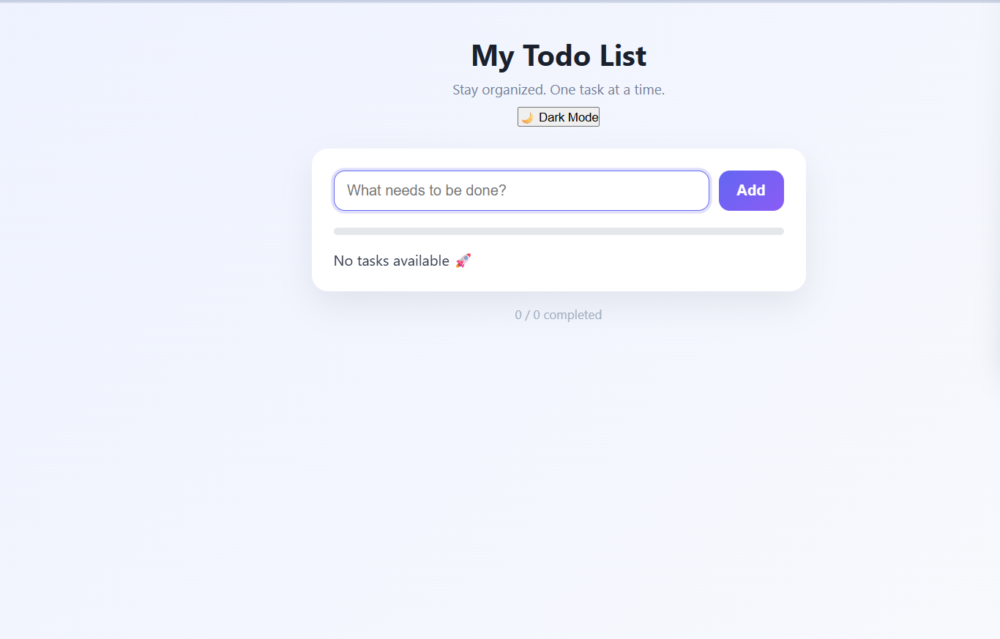
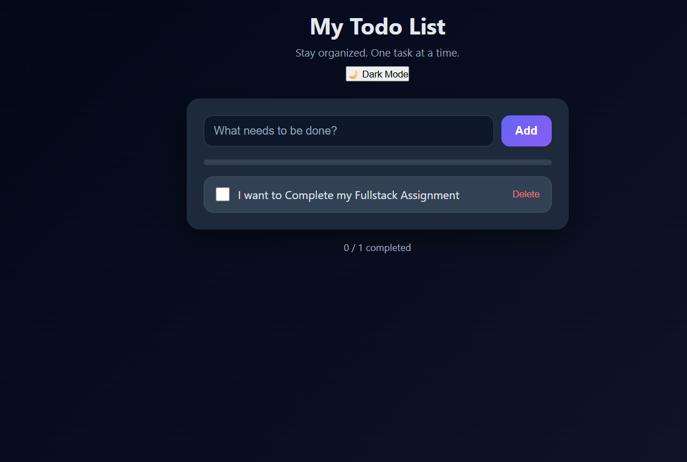
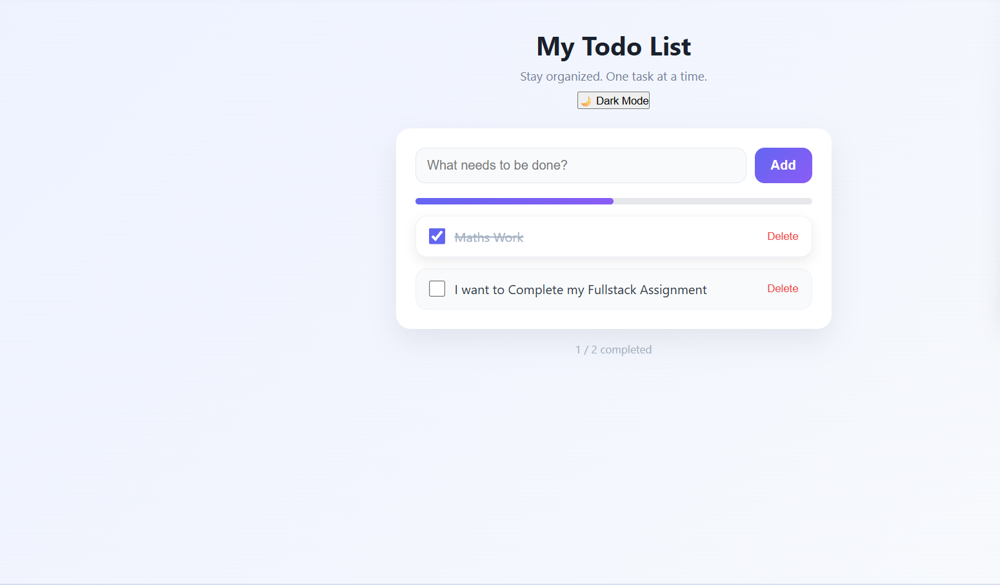

# 📝 TodoAI: Full Stack Todo Application

> A modern and responsive full stack task manager with real-time updates, progress tracking, and persistent storage.

TodoAI is a complete full stack web application designed to help users manage their daily tasks efficiently. It integrates a clean frontend interface with a powerful backend and MongoDB database to deliver a smooth and interactive experience.

## 🌟 What makes it special?

* Seamless Full Stack Integration – Smooth communication between frontend and backend
* Persistent Data Storage – Tasks are stored in MongoDB and remain after refresh
* Modern UI Design – Clean, minimal, and responsive layout
* Progress Tracking System – Visual indicator of completed tasks
* Dark Mode Support – Enhanced user experience
* Instant Updates – Real-time UI updates without page reload

## 🖥 System Overview & Screenshots

### 🎨 User Interface

| Light Mode                           | Dark Mode                          |
| ------------------------------------ | ---------------------------------- |
|  |  |

### ⚙️ Working Application

| Application Preview                 |
| ----------------------------------- |
|  |

## 📂 Project Structure

Todo-App/
├── backend/                # Backend (Node.js + Express)
│   ├── node_modules/
│   ├── package.json
│   ├── package-lock.json
│   ├── server.js           # API routes and DB connection
│
├── frontend/               # Frontend (HTML, CSS, JS)
│   ├── index.html          # UI structure
│   ├── style.css           # Styling (light + dark mode)
│   ├── script.js           # Logic & API integration
│
├── Screenshots/            # Screenshots used in README
│   ├── Light.png
│   ├── Dark.png
│   ├── Working.png
│
└── README.md

## 🛠 Tech Stack

### 🔹 Frontend

* HTML5
* CSS3
* JavaScript (Vanilla)

### 🔹 Backend

* Node.js
* Express.js

### 🔹 Database

* MongoDB (Mongoose)

### 🔹 Architecture

* REST API (Client-Server Model)

## 🔬 System Working

### 📌 Core Functionalities

* Add Task → Store task in database
* View Tasks → Fetch tasks from backend
* Complete Task → Update completion status
* Delete Task → Remove task permanently

### 🔄 Data Flow

Frontend → Express API → MongoDB → Express API → Frontend

## 🚀 Features

* Add tasks instantly
* Delete tasks with animation
* Mark tasks as completed
* Visual progress bar
* Clean and responsive UI
* Dark / Light mode toggle

## 📥 Installation & Setup

### 1️⃣ Clone Repository

git clone https://github.com/hu17-m/ToDo-FullStack-.git
cd ToDo-FullStack-

### 2️⃣ Backend Setup

cd backend
npm install
node server.js

Server will run at:

http://localhost:5000

### 3️⃣ Frontend Setup

Open the following file in your browser:

frontend/index.html

OR use Live Server (VS Code)

## 🔗 API Endpoints

| Method | Endpoint   | Description       |
| ------ | ---------- | ----------------- |
| GET    | /todos     | Fetch all tasks   |
| POST   | /todos     | Add new task      |
| PUT    | /todos/:id | Toggle completion |
| DELETE | /todos/:id | Delete task       |

## 👨‍💻 Developed By

Himanshu Gadekar
Final Year B.Tech CSE (2026)

🔗 GitHub: https://github.com/hu17-m
🔗 Project Repo: https://github.com/hu17-m/ToDo-FullStack-

## 🎯 Future Enhancements

* [ ] User Authentication (Login/Signup)
* [ ] Edit Task Feature
* [ ] Task Deadlines & Reminders
* [ ] Cloud Deployment (Render / Vercel)
* [ ] React Frontend Upgrade

## 📌 Conclusion

This project demonstrates a complete full stack CRUD application with frontend-backend integration, database persistence, and a modern user interface. It serves as a strong foundation for real-world applications and technical interviews.

GitHub (https://github.com/hu17-m)
hu17-m - Overview
hu17-m has 7 repositories available. Follow their code on GitHub.